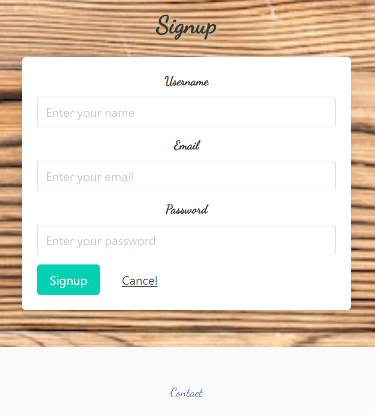
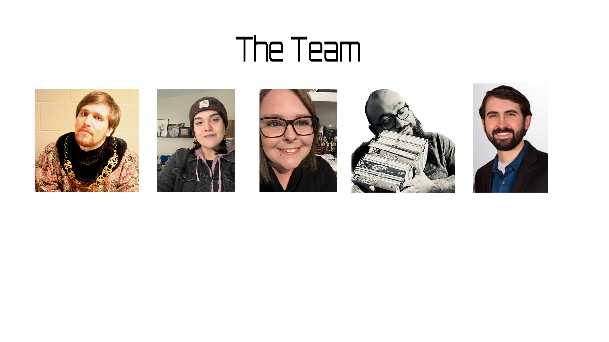

# On The Shelf

## *Table of Contents*

- [Our Process](#our-process)
- [Description](#description)
- [How to use](#how-to-use)
- [Application](#application)
- [Contributers](#contributers)
- [Collaborators](#collaborators)
- [Built With](#built-with)
- [Future Updates](#future-updates)
- [License](#license)

## Our Process

## *Description*

This application is to have all of your games saved into a personal database to make choosing a game a breeze!
 
## *How to use*

To use this application you will need to first sign up. Once signed up you can catalog your first game to add to your personal shelf. Then you will be able to quickly find a game that works for your group. 

## *Application*

- [Deployed application]()

## *Contributers*
***Danny Cohen*** https://github.com/dctristero 
***Jacqueline Martinez*** https://github.com/JackieAmartinez 
***Lindsey Isaac*** https://github.com/LindseyIsaac 
***Matt Montiel*** https://github.com/MatthewMontiel 
***M Vincent Richards*** https://github.com/vrich88 

## *Collaborators*
***Rachel Solov-TA*** Bulma consultant, coding guidence, and ESP 
***Derek Beckford-TA***coding guidence and ESP 
***Matthew Calimbas*** Tutor 
***Robbie Kurle*** Tutor 

## *Built With*
Handlebars 
Bulma 

## *Future Development*

Improvements and enhancements in progress: 
•Visual Representation: include associated imagery for items in collection 
•Personalizing: add themed page views such as sci-fi, kids, modern, ect. 
•Shelving Options: for users to catalog other collections such as records, comics, movies, etc. 
•As we implement these changes we will include more sorting parameters for each catalog. 

## *License*

MIT License

Copyright (c) 2023 MatthewMontiel
